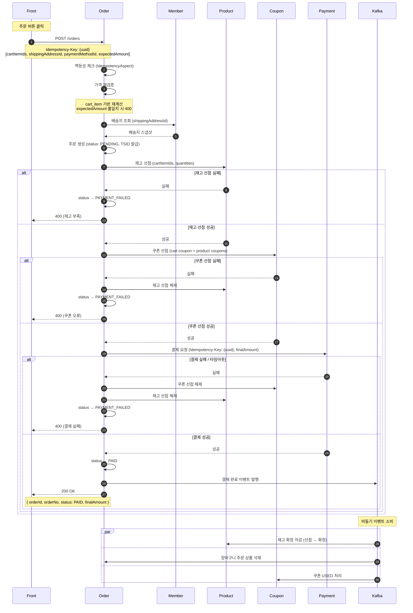

# 주문 설계

## 1. 시퀀스 다이어그램



---

## 2. 주문 상태 모델

```
PENDING → PAID → PREPARING → SHIPPING → DELIVERED
       ↘ PAYMENT_FAILED
       ↘ EXPIRED (TTL 초과 스케줄러 처리)
       ↘ CANCELLED
```

| 상태             | 설명                          |
|----------------|-----------------------------|
| PENDING        | 주문 생성 직후, 결제 완료 전           |
| PAID           | 결제 완료                       |
| PAYMENT_FAILED | 결제 실패 (보상 완료)               |
| EXPIRED        | PENDING TTL 초과로 스케줄러가 보상 처리 |
| PREPARING      | 상품 준비 중                     |
| SHIPPING       | 배송 중                        |
| DELIVERED      | 배송 완료                       |
| CANCELLED      | 주문 취소                       |

---

## 2. 주문 생성 API

### 요청

```
POST /orders
Idempotency-Key: {client-generated-uuid}   # 필수 헤더, 누락 시 400
```

```json
{
  "cartItemIds": [
    1,
    2,
    3
  ],
  "shippingAddressId": 10,
  "paymentMethodId": 5,
  "expectedAmount": 88000
}
```

- `cartItemIds`: 주문할 장바구니 상품 ID 목록
- `shippingAddressId`: 선택한 배송지 ID (배송지 스냅샷 조회용, member-server 호출)
- `paymentMethodId`: 선택한 결제 수단 ID
- `expectedAmount`: 클라이언트가 주문서 화면에서 보고 있던 최종 결제 금액 (가격 재검증용)
- 적용 쿠폰: 별도 전달 없이 서버가 `cart.coupon_id`, `cart_item.coupon_id`에서 직접 조회

### 응답

```json
{
  "orderId": 1,
  "orderNo": "09XXXXXXXXXXXXXXXXX",
  "status": "PAID",
  "finalAmount": 88000
}
```

---

## 3. 멱등성 처리

### 클라이언트 → 주문 서버

- **생성 주체**: 클라이언트 (UUID)
- **전달 방식**: `Idempotency-Key` 헤더 (필수, 누락 시 400)
- **처리**: `IdempotencyAspect` (common-module) 적용, order-server에 `IdempotencyStore` / `IdempotencyLock` 구현체 추가 필요
- 동일 `Idempotency-Key`로 재요청 시 캐싱된 응답 반환, 비즈니스 로직 재실행 없음

### 주문 서버 → 결제 서버

- **키**: 클라이언트가 전달한 `Idempotency-Key` (UUID) 그대로 전달
- 결제 서버는 자체 scope로 격리 저장하므로 주문 서버 스코프와 충돌 없음
- 주문번호(TSID)는 비즈니스 식별자 역할만 담당

---

## 4. 주문 생성 플로우

```
1. 멱등성 체크 (IdempotencyAspect)
2. =++++_+가격 재검증
   - cart_item 기반 서버 재계산 (상품 할인가 + 쿠폰 할인 + 배송비)
   - expectedAmount 불일치 시 400 (가격 변동 안내)
3. member-server에서 배송지 스냅샷 조회
4. 주문 Row 생성 (status: PENDING, 주문번호 TSID 발급, 배송지 스냅샷 저장)
5. 재고 선점 (product-server)
   - 실패 시 → PAYMENT_FAILED 처리 후 종료
6. 쿠폰 선점 (coupon-server, RESERVED 상태)
   - 실패 시 → 재고 선점 해제 → PAYMENT_FAILED 처리 후 종료
7. 결제 요청 (payment-server, 동기)
   - 실패 / 타임아웃 → 쿠폰 선점 해제 + 재고 선점 해제 → PAYMENT_FAILED 처리 후 종료
   - 성공 → 주문 상태 PAID 저장
8. 카프카 결제 완료 이벤트 발행
```

---

## 5. 보상 트랜잭션 정책

| 실패 지점        | 보상 대상               |
|--------------|---------------------|
| 재고 선점 실패     | 없음                  |
| 쿠폰 선점 실패     | 재고 선점 해제            |
| 결제 실패 / 타임아웃 | 쿠폰 선점 해제 + 재고 선점 해제 |

- 타임아웃은 실패로 간주하여 보상 처리
- 보상 API 호출 실패 시 재시도 및 로그 기록

---

## 6. 결제 완료 이벤트 소비

결제 완료 이벤트 발행 후 각 서버가 비동기 소비:

| 소비자                    | 처리 내용                     |
|------------------------|---------------------------|
| product-server         | 재고 원자적 차감 확정 (선점 → 확정)    |
| order-server (cart 모듈) | 주문된 cartItemIds 장바구니에서 삭제 |
| coupon-server          | 주문에 사용된 쿠폰 USED 처리        |

- 이벤트 발행은 카프카 직접 발행 (추후 아웃박스 고려)

---

## 7. PENDING 만료 처리

- PENDING 상태로 일정 시간(예: 30분) 초과한 주문을 스케줄러가 주기적으로 조회
- 각 주문에 대해 쿠폰 선점 해제 + 재고 선점 해제 → 상태 EXPIRED 처리
- PENDING 중복 허용: 동일 회원이 여러 PENDING 주문 보유 가능
    - 동일 쿠폰/재고 경합은 선점 단계에서 자연 충돌 처리

---

## 8. 부분 취소 환불 정책

### 상품 쿠폰 적용 아이템 취소

- 해당 상품과 쿠폰이 1:1로 묶여 있어 조건 재검증 없음
- 환불 = `order_item.final_amount` + 상품 쿠폰 반환

### 주문 쿠폰 적용 아이템 취소

| 상황                | 환불 금액                                                       | 쿠폰 반환 |
|-------------------|-------------------------------------------------------------|-------|
| 조건 충족 유지          | `final_amount`                                              | X     |
| 조건 미달 발생 시점       | `final_amount - sum(잔여 아이템들의 order_coupon_discount_amount)` | O     |
| 조건 미달 이후 (마지막 포함) | `final_amount + order_coupon_discount_amount`               | -     |

**예시** (5,000원 × 3개, 3개 이상 조건, 쿠폰 150원 → 50원/개, final_amount = 4,950원)

| 취소 순서       | 계산                  | 환불액   |
|-------------|---------------------|-------|
| 1번째 (조건 미달) | `4,950 - (50 + 50)` | 4,850 |
| 2번째         | `4,950 + 50`        | 5,000 |
| 3번째 (마지막)   | `4,950 + 50`        | 5,000 |

총합: 14,850 ✓

- 조건 미달 시점에 잔여 아이템 쿠폰 안분액을 한 번에 회수
- 이후 취소는 쿠폰 없는 정가(`unit_price * quantity - product_coupon_discount_amount`) 환불

---

## 9. 테이블 설계

```sql
CREATE TABLE `order` (
  id                      BIGINT       AUTO_INCREMENT PRIMARY KEY,
  order_no                VARCHAR(50)  NOT NULL UNIQUE,
  member_id               BIGINT       NOT NULL,
  total_amount            INT          NOT NULL COMMENT '상품 정가 합계',
  delivery_fee            INT          NOT NULL DEFAULT 0,
  product_discount_amount INT          NOT NULL DEFAULT 0 COMMENT '상품 자체 할인 합계',
  coupon_discount_amount  INT          NOT NULL DEFAULT 0 COMMENT '쿠폰 할인 합계 (주문 + 상품)',
  final_amount            INT          NOT NULL COMMENT '실제 결제금액',
  status                  VARCHAR(20)  NOT NULL COMMENT 'PENDING, PAID, PAYMENT_FAILED, EXPIRED, PREPARING, SHIPPING, DELIVERED, CANCELLED',
  member_coupon_id        BIGINT       DEFAULT NULL COMMENT '적용된 주문(장바구니) 쿠폰',
  receiver_name           VARCHAR(50)  NOT NULL COMMENT '배송지 스냅샷',
  receiver_phone          VARCHAR(20)  NOT NULL,
  zip_code                VARCHAR(10)  NOT NULL,
  address                 VARCHAR(255) NOT NULL,
  address_detail          VARCHAR(100) NOT NULL,
  created_at              DATETIME     NOT NULL DEFAULT CURRENT_TIMESTAMP,
  updated_at              DATETIME     NOT NULL DEFAULT CURRENT_TIMESTAMP ON UPDATE CURRENT_TIMESTAMP
);

CREATE TABLE order_item (
  id                             BIGINT       AUTO_INCREMENT PRIMARY KEY,
  order_id                       BIGINT       NOT NULL,
  product_id                     BIGINT       NOT NULL,
  product_name                   VARCHAR(100) NOT NULL,
  unit_price                     INT          NOT NULL COMMENT '정가',
  discounted_price               INT          NOT NULL COMMENT '상품 자체 할인가',
  quantity                       INT          NOT NULL,
  product_coupon_discount_amount INT          NOT NULL DEFAULT 0 COMMENT '상품 쿠폰 할인액',
  order_coupon_discount_amount   INT          NOT NULL DEFAULT 0 COMMENT '주문 쿠폰 안분액',
  final_amount                   INT          NOT NULL COMMENT 'discounted_price * quantity - product_coupon_discount - order_coupon_discount',
  member_coupon_id               BIGINT       DEFAULT NULL COMMENT '적용된 상품 쿠폰',
  status                         VARCHAR(20)  NOT NULL DEFAULT 'ORDERED' COMMENT 'ORDERED, CANCELLED',
  created_at                     DATETIME     NOT NULL DEFAULT CURRENT_TIMESTAMP,
  updated_at                     DATETIME     NOT NULL DEFAULT CURRENT_TIMESTAMP ON UPDATE CURRENT_TIMESTAMP,
  FOREIGN KEY (order_id) REFERENCES `order`(id)
);

CREATE TABLE order_history (
  id          BIGINT      AUTO_INCREMENT PRIMARY KEY,
  order_id    BIGINT      NOT NULL,
  from_status VARCHAR(20)          COMMENT '최초 생성 시 NULL',
  to_status   VARCHAR(20) NOT NULL,
  reason      VARCHAR(255),
  created_at  DATETIME    NOT NULL DEFAULT CURRENT_TIMESTAMP,
  FOREIGN KEY (order_id) REFERENCES `order`(id)
);

CREATE TABLE order_item_cancel_history (
  id               BIGINT     AUTO_INCREMENT PRIMARY KEY,
  order_id         BIGINT     NOT NULL,
  order_item_id    BIGINT     NOT NULL,
  refund_amount    INT        NOT NULL,
  coupon_returned  TINYINT(1) NOT NULL DEFAULT 0,
  member_coupon_id BIGINT     DEFAULT NULL COMMENT '반환된 쿠폰 ID',
  cancel_reason    VARCHAR(255),
  created_at       DATETIME   NOT NULL DEFAULT CURRENT_TIMESTAMP,
  FOREIGN KEY (order_id)      REFERENCES `order`(id),
  FOREIGN KEY (order_item_id) REFERENCES order_item(id)
);
```

### 금액 관계

```
order.total_amount            = SUM(order_item.unit_price * quantity)
order.product_discount_amount = SUM((unit_price - discounted_price) * quantity)
order.coupon_discount_amount  = SUM(product_coupon_discount_amount + order_coupon_discount_amount)
order.final_amount            = SUM(order_item.final_amount) + delivery_fee
```

### 이력 적재 시점

| 이벤트        | order_history            | order_item_cancel_history         |
|------------|--------------------------|-----------------------------------|
| 주문 생성      | NULL → PENDING           | -                                 |
| 결제 완료      | PENDING → PAID           | -                                 |
| 결제 실패      | PENDING → PAYMENT_FAILED | -                                 |
| PENDING 만료 | PENDING → EXPIRED        | -                                 |
| 아이템 부분 취소  | -                        | refund_amount, coupon_returned 기록 |
| 전체 취소      | PAID → CANCELLED         | 각 아이템별 row                        |