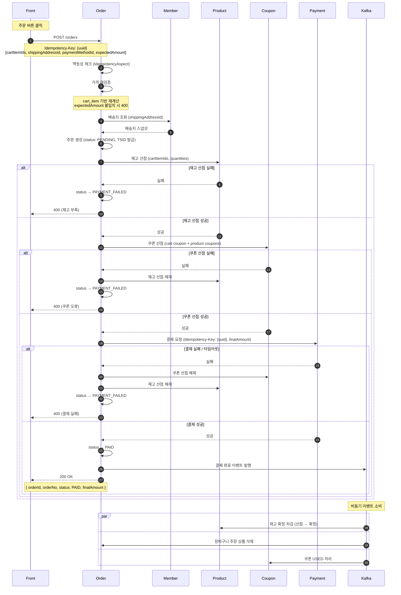

# 주문 설계

## 1. 시퀀스 다이어그램



---

## 2. 주문 / 결제 상태 모델

### order.status (결제/클레임)

```
PENDING → PAID → PARTIAL_CANCELLED (일부 취소 발생)
               → CANCELLED (전체 취소)
       ↘ PAYMENT_FAILED
       ↘ EXPIRED (TTL 초과 스케줄러 처리)
```

| 상태                | 설명                          |
|-------------------|-----------------------------|
| PENDING           | 주문 생성 직후, 결제 완료 전           |
| PAID              | 결제 완료                       |
| PAYMENT_FAILED    | 결제 실패 (보상 완료)               |
| EXPIRED           | PENDING TTL 초과로 스케줄러가 보상 처리 |
| PARTIAL_CANCELLED | 일부 아이템 취소 발생                |
| CANCELLED         | 전체 취소                       |

### order_item.status (아이템 생명주기)

```
PENDING → ORDERED → PREPARING → SHIPPING → DELIVERED
                  → CANCELLED
                  → RETURN_REQUESTED → RETURNED
        → EXPIRED
        → PAYMENT_FAILED
```

| 상태               | 설명                          |
|------------------|-----------------------------|
| PENDING          | 주문 생성 직후, 결제 완료 전           |
| ORDERED          | 결제 완료, 처리 대기                |
| PREPARING        | 상품 준비 중                     |
| SHIPPING         | 배송 중                        |
| DELIVERED        | 배송 완료                       |
| CANCELLED        | 취소 완료                       |
| RETURN_REQUESTED | 반품 요청 (회수 중)                |
| RETURNED         | 반품 완료                       |
| EXPIRED          | PENDING TTL 초과로 스케줄러가 만료 처리 |
| PAYMENT_FAILED   | 결제 실패로 주문 불성립               |

> 아이템마다 배송 일정이 다를 수 있으므로 배송 상태는 order_item이 진실의 원천(source of truth).  
> order 레벨 배송 현황이 필요한 경우 item 상태를 집계하여 계산한다.

---

## 3. 주문 생성 API

### 요청

```
POST /orders
Idempotency-Key: {client-generated-uuid}   # 필수 헤더, 누락 시 400
```

```json
{
  "cartItemIds": [
    1,
    2,
    3
  ],
  "shippingAddressId": 10,
  "paymentMethodId": 5,
  "expectedAmount": 88000
}
```

- `cartItemIds`: 주문할 장바구니 상품 ID 목록
- `shippingAddressId`: 선택한 배송지 ID (배송지 스냅샷 조회용, member-server 호출)
- `paymentMethodId`: 선택한 결제 수단 ID
- `expectedAmount`: 클라이언트가 주문서 화면에서 보고 있던 최종 결제 금액 (가격 재검증용)
- 적용 쿠폰: 별도 전달 없이 서버가 `cart.coupon_id`, `cart_item.coupon_id`에서 직접 조회

### 응답

```json
{
  "orderId": 1,
  "orderNo": "09XXXXXXXXXXXXXXXXX",
  "status": "PAID",
  "finalAmount": 88000
}
```

---

## 4. 멱등성 처리

### 클라이언트 → 주문 서버

- **생성 주체**: 클라이언트 (UUID)
- **전달 방식**: `Idempotency-Key` 헤더 (필수, 누락 시 400)
- **처리**: `IdempotencyAspect` (common-module) 적용, order-server에 `IdempotencyStore` / `IdempotencyLock` 구현체 추가 필요
- 동일 `Idempotency-Key`로 재요청 시 캐싱된 응답 반환, 비즈니스 로직 재실행 없음

### 주문 서버 → 결제 서버

- **키**: 클라이언트가 전달한 `Idempotency-Key` (UUID) 그대로 전달
- 결제 서버는 자체 scope로 격리 저장하므로 주문 서버 스코프와 충돌 없음
- 주문번호(TSID)는 비즈니스 식별자 역할만 담당

---

## 5. 주문 생성 플로우

```
1. 멱등성 체크 (IdempotencyAspect)
2. 가격 재검증
   - cart_item 기반 서버 재계산 (상품 할인가 + 쿠폰 할인 + 배송비)
   - expectedAmount 불일치 시 400 (가격 변동 안내)
3. member-server에서 배송지 스냅샷 조회
4. 주문 Row 생성 (status: PENDING, 주문번호 TSID 발급, 배송지 스냅샷 저장)
5. 재고 선점 (product-server)
   - 실패 시 → PAYMENT_FAILED 처리 후 종료
6. 쿠폰 선점 (coupon-server, RESERVED 상태)
   - 실패 시 → 재고 선점 해제 → PAYMENT_FAILED 처리 후 종료
7. 결제 요청 (payment-server, 동기)
   - 실패 / 타임아웃 → 쿠폰 선점 해제 + 재고 선점 해제 → PAYMENT_FAILED 처리 후 종료
   - 성공 → 주문 상태 PAID 저장
8. 카프카 결제 완료 이벤트 발행
```

---

## 6. 보상 트랜잭션 정책

| 실패 지점        | 보상 대상               |
|--------------|---------------------|
| 재고 선점 실패     | 없음                  |
| 쿠폰 선점 실패     | 재고 선점 해제            |
| 결제 실패 / 타임아웃 | 쿠폰 선점 해제 + 재고 선점 해제 |

- 타임아웃은 실패로 간주하여 보상 처리
- 보상 API 호출 실패 시 재시도 및 로그 기록

---

## 7. 결제 완료 이벤트 소비

결제 완료 이벤트 발행 후 각 서버가 비동기 소비:

| 소비자                    | 처리 내용                     |
|------------------------|---------------------------|
| product-server         | 재고 원자적 차감 확정 (선점 → 확정)    |
| order-server (cart 모듈) | 주문된 cartItemIds 장바구니에서 삭제 |
| coupon-server          | 주문에 사용된 쿠폰 USED 처리        |

- 이벤트 발행은 카프카 직접 발행 (추후 아웃박스 고려)

---

## 8. PENDING 만료 처리

- PENDING 상태로 일정 시간(예: 30분) 초과한 주문을 스케줄러가 주기적으로 조회
- 각 주문에 대해 쿠폰 선점 해제 + 재고 선점 해제 → 상태 EXPIRED 처리
- PENDING 중복 허용: 동일 회원이 여러 PENDING 주문 보유 가능
    - 동일 쿠폰/재고 경합은 선점 단계에서 자연 충돌 처리

---

## 9. 부분 취소 / 반품 환불 정책

### 반품 환불

- 반품 요청 시 `order_event(RETURN_REQUESTED)` + `order_event_item` 생성, `order_item.status → RETURN_REQUESTED`
- 반품 회수 확인 후 환불 처리: `order_event(RETURN_COMPLETED)` + `payment_event(PARTIAL_REFUND or FULL_REFUND)` 생성,
  `order_item.status → RETURNED`
- 환불 금액 계산은 아래 취소 정책과 동일하게 적용

### 상품 쿠폰 적용 아이템 취소

- 해당 상품과 쿠폰이 1:1로 묶여 있어 조건 재검증 없음
- 환불 = `order_item.final_amount` + 상품 쿠폰 반환

### 주문 쿠폰 적용 아이템 취소

| 상황                | 환불 금액                                                       | 쿠폰 반환 |
|-------------------|-------------------------------------------------------------|-------|
| 조건 충족 유지          | `final_amount`                                              | X     |
| 조건 미달 발생 시점       | `final_amount - sum(잔여 아이템들의 order_coupon_discount_amount)` | O     |
| 조건 미달 이후 (마지막 포함) | `final_amount + order_coupon_discount_amount`               | -     |

**예시** (5,000원 × 3개, 3개 이상 조건, 쿠폰 150원 → 50원/개, final_amount = 4,950원)

| 취소 순서       | 계산                  | 환불액   |
|-------------|---------------------|-------|
| 1번째 (조건 미달) | `4,950 - (50 + 50)` | 4,850 |
| 2번째         | `4,950 + 50`        | 5,000 |
| 3번째 (마지막)   | `4,950 + 50`        | 5,000 |

총합: 14,850 ✓

- 조건 미달 시점에 잔여 아이템 쿠폰 안분액을 한 번에 회수
- 이후 취소는 쿠폰 없는 정가(`unit_price * quantity - product_coupon_discount_amount`) 환불

---

## 10. 취소 API

### 요청

```
POST /orders/{orderId}/cancel
```

```json
{
  "orderItemIds": [
    1,
    2
  ],
  "reason": "단순 변심"
}
```

- `orderItemIds`가 주문의 전체 아이템이면 전체 취소, 일부면 부분 취소

### 처리 흐름

```
1. 취소 가능 상태 검증 (ORDERED 또는 PREPARING만 허용)
2. order_item.status → CANCELLED
3. order_event(ORDER_CANCELLED or ORDER_PARTIALLY_CANCELLED) + order_event_item 생성
4. order.status → CANCELLED or PARTIAL_CANCELLED
5. payment.status → REFUND_REQUESTED
6. payment_event(REFUND_REQUESTED) 생성
```

---

## 11. 반품 API

### 반품 요청

```
POST /orders/{orderId}/returns
```

```json
{
  "orderItemIds": [
    1
  ],
  "reason": "상품 불량"
}
```

- DELIVERED 상태 아이템만 반품 요청 가능

### 처리 흐름

```
1. 반품 가능 상태 검증 (DELIVERED만 허용)
2. order_item.status → RETURN_REQUESTED
3. order_event(RETURN_REQUESTED) + order_event_item 생성
4. payment.status → REFUND_REQUESTED
5. payment_event(REFUND_REQUESTED) 생성
```

### 반품 완료 처리 (관리자)

```
POST /admin/orders/{orderId}/returns/complete
```

```json
{
  "orderItemIds": [
    1
  ]
}
```

### 처리 흐름

```
1. order_item.status → RETURNED
2. order_event(RETURN_COMPLETED) 생성
3. payment_event(PARTIAL_REFUNDED or FULL_REFUNDED) 생성
4. payment.status → PARTIAL_REFUNDED or REFUNDED
```

---

## 12. 배송 상태 업데이트 (이벤트 소비)

- 배송 도메인이 외부 배송사로부터 폴링 또는 웹훅으로 상태 수신
- 배송 도메인이 배송 상태 변경 이벤트 발행
- order-server가 이벤트 소비 → order_item.status 업데이트
- 허용 전이: `ORDERED → PREPARING → SHIPPING → DELIVERED` (순방향만)

---

## 13. 환불 실패 처리 정책

- `payment.status`는 `REFUND_REQUESTED` 유지
- `payment_event(REFUND_FAILED)` 기록
- 최대 3회 자동 재시도 (지수 백오프)
- 3회 실패 시 수동 처리 대기 (관리자 알림)

---

## 14. 테이블 설계

```sql
CREATE TABLE `order` (
  id                      BIGINT       AUTO_INCREMENT PRIMARY KEY,
  order_no                VARCHAR(50)  NOT NULL UNIQUE,
  member_id               BIGINT       NOT NULL,
  total_amount            INT          NOT NULL COMMENT '상품 정가 합계',
  delivery_fee            INT          NOT NULL DEFAULT 0,
  product_discount_amount INT          NOT NULL DEFAULT 0 COMMENT '상품 자체 할인 합계',
  coupon_discount_amount  INT          NOT NULL DEFAULT 0 COMMENT '쿠폰 할인 합계 (주문 + 상품)',
  final_amount            INT          NOT NULL COMMENT '실제 결제금액',
  status                  VARCHAR(20)  NOT NULL COMMENT 'PENDING, PAID, PARTIAL_CANCELLED, CANCELLED, PAYMENT_FAILED, EXPIRED',
  refunded_amount         INT          NOT NULL DEFAULT 0 COMMENT '누적 환불액',
  member_coupon_id        BIGINT       DEFAULT NULL COMMENT '적용된 주문(장바구니) 쿠폰',
  receiver_name           VARCHAR(50)  NOT NULL COMMENT '배송지 스냅샷',
  receiver_phone          VARCHAR(20)  NOT NULL,
  zip_code                VARCHAR(10)  NOT NULL,
  address                 VARCHAR(255) NOT NULL,
  address_detail          VARCHAR(100) NOT NULL,
  created_at              DATETIME     NOT NULL DEFAULT CURRENT_TIMESTAMP,
  updated_at              DATETIME     NOT NULL DEFAULT CURRENT_TIMESTAMP ON UPDATE CURRENT_TIMESTAMP
);

CREATE TABLE order_item (
  id                             BIGINT       AUTO_INCREMENT PRIMARY KEY,
  order_id                       BIGINT       NOT NULL,
  product_id                     BIGINT       NOT NULL,
  product_name                   VARCHAR(100) NOT NULL,
  unit_price                     INT          NOT NULL COMMENT '정가',
  discounted_price               INT          NOT NULL COMMENT '상품 자체 할인가',
  quantity                       INT          NOT NULL,
  product_coupon_discount_amount INT          NOT NULL DEFAULT 0 COMMENT '상품 쿠폰 할인액',
  order_coupon_discount_amount   INT          NOT NULL DEFAULT 0 COMMENT '주문 쿠폰 안분액',
  final_amount                   INT          NOT NULL COMMENT 'discounted_price * quantity - product_coupon_discount - order_coupon_discount',
  member_coupon_id               BIGINT       DEFAULT NULL COMMENT '적용된 상품 쿠폰',
  status                         VARCHAR(20)  NOT NULL DEFAULT 'PENDING' COMMENT 'PENDING, ORDERED, PREPARING, SHIPPING, DELIVERED, CANCELLED, EXPIRED, PAYMENT_FAILED, RETURN_REQUESTED, RETURNED',
  created_at                     DATETIME     NOT NULL DEFAULT CURRENT_TIMESTAMP,
  updated_at                     DATETIME     NOT NULL DEFAULT CURRENT_TIMESTAMP ON UPDATE CURRENT_TIMESTAMP,
  FOREIGN KEY (order_id) REFERENCES `order`(id)
);

CREATE TABLE order_event (
  id         BIGINT      AUTO_INCREMENT PRIMARY KEY,
  order_id   BIGINT      NOT NULL,
  event_type VARCHAR(20) NOT NULL COMMENT 'ORDER_CREATED, ORDER_PARTIALLY_CANCELLED, ORDER_CANCELLED, RETURN_REQUESTED, RETURN_COMPLETED',
  reason     VARCHAR(255),
  created_at DATETIME    NOT NULL DEFAULT CURRENT_TIMESTAMP,
  FOREIGN KEY (order_id) REFERENCES `order`(id)
);

CREATE TABLE order_event_item (
  id             BIGINT   AUTO_INCREMENT PRIMARY KEY,
  order_event_id BIGINT   NOT NULL,
  order_item_id  BIGINT   NOT NULL,
  quantity       INT      NOT NULL,
  refund_amount  INT      NULL DEFAULT NULL COMMENT 'ORDER_CREATED 이벤트는 NULL',
  created_at     DATETIME NOT NULL DEFAULT CURRENT_TIMESTAMP,
  FOREIGN KEY (order_event_id) REFERENCES order_event(id),
  FOREIGN KEY (order_item_id)  REFERENCES order_item(id)
);

CREATE TABLE payment (
  id              BIGINT      AUTO_INCREMENT PRIMARY KEY,
  order_id        BIGINT      NOT NULL UNIQUE,
  amount          INT         NOT NULL,
  method          VARCHAR(20) NOT NULL,
  status          VARCHAR(20) NOT NULL DEFAULT 'READY' COMMENT 'READY, PAID, FAILED, REFUND_REQUESTED, PARTIAL_REFUNDED, REFUNDED',
  refunded_amount INT         NOT NULL DEFAULT 0 COMMENT '누적 환불액',
  pg_tid          VARCHAR(100) NULL UNIQUE,
  expires_at      DATETIME    NOT NULL,
  created_at      DATETIME    NOT NULL DEFAULT CURRENT_TIMESTAMP,
  updated_at      DATETIME    NOT NULL DEFAULT CURRENT_TIMESTAMP ON UPDATE CURRENT_TIMESTAMP
);

CREATE TABLE payment_event (
  id             BIGINT      AUTO_INCREMENT PRIMARY KEY,
  payment_id     BIGINT      NOT NULL,
  event_type     VARCHAR(20) NOT NULL COMMENT 'PAYMENT_COMPLETED, REFUND_REQUESTED, REFUND_FAILED, PARTIAL_REFUNDED, FULL_REFUNDED',
  amount         INT         NOT NULL,
  order_event_id BIGINT      DEFAULT NULL COMMENT '취소, 반품으로 인한 환불인 경우 참조 (DB FK 없음)',
  created_at     DATETIME    NOT NULL DEFAULT CURRENT_TIMESTAMP,
  FOREIGN KEY (payment_id) REFERENCES payment(id)
);
```

### 금액 관계

```
order.total_amount            = SUM(order_item.unit_price * quantity)
order.product_discount_amount = SUM((unit_price - discounted_price) * quantity)
order.coupon_discount_amount  = SUM(product_coupon_discount_amount + order_coupon_discount_amount)
order.final_amount            = SUM(order_item.final_amount) + delivery_fee
```

### 이력 적재 시점

| 이벤트      | order.status      | order_event               | order_event_item | payment.status               | payment_event                     |
|----------|-------------------|---------------------------|------------------|------------------------------|-----------------------------------|
| 결제 완료    | PAID              | ORDER_CREATED             | -                | PAID                         | PAYMENT_COMPLETED                 |
| 부분 취소    | PARTIAL_CANCELLED | ORDER_PARTIALLY_CANCELLED | 취소 아이템 row       | REFUND_REQUESTED             | REFUND_REQUESTED                  |
| 전체 취소    | CANCELLED         | ORDER_CANCELLED           | 전체 아이템 row       | REFUND_REQUESTED             | REFUND_REQUESTED                  |
| 부분 환불 완료 | -                 | -                         | -                | PARTIAL_REFUNDED             | PARTIAL_REFUNDED                  |
| 전체 환불 완료 | -                 | -                         | -                | REFUNDED                     | FULL_REFUNDED                     |
| 반품 요청    | -                 | RETURN_REQUESTED          | 반품 아이템 row       | REFUND_REQUESTED             | REFUND_REQUESTED                  |
| 반품 완료 환불 | -                 | RETURN_COMPLETED          | -                | PARTIAL_REFUNDED or REFUNDED | PARTIAL_REFUNDED or FULL_REFUNDED |

---

## 15. TODO

- 교환 기능: product_option, product_variant 테이블 설계 선행 필요
- payment, payment_event → 결제 서비스 문서로 이관 고려